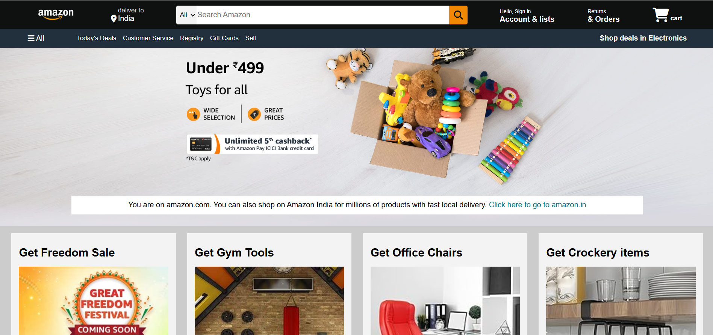

# 🛒 Amazon Clone (Frontend Only)

A simple and responsive **Amazon website clone** built using only **HTML** and **CSS**. This was my **first web development project**, where I focused on understanding webpage structure, layout design, and styling.

🔗 **Live Demo:** [Click Here](https://amazon-clone-maor-9mukmib20-hemant2871s-projects.vercel.app)

## ✨ Features

- 🧱 Structured layout similar to the original Amazon homepage
- 🎨 CSS-only styling (no JavaScript)
- 📱 Fully responsive for different screen sizes
- 🧭 Functional header, navbar, product sections, and footer

## 🛠️ Tech Stack

- **Frontend:** HTML, CSS
- **Deployment:** Vercel

## 📁 Folder Structure

amazon-clone/
```
├── index.html
├── style.css
├── README.md
├── amzon_logo.png
├── box_eight.jpg
├── box_one.jpg
├── box_two.jpg
├── box_three.jpg
├── box_four.jpg
├── box_five.jpg
├── box_six.jpg
├── box_seven.jpg
├── hero_image.jpg
└── img.png
```


## 🚀 How to Run Locally

1. Clone the repository:
   ```bash
   git clone https://github.com/hemant2871/amazon-clone.git
   cd amazon-clone
2. Open index.html in your browser.
   

  ### 📚 What I Learned
HTML page structure and semantic tags

CSS Flexbox and grid systems

Styling buttons, cards, headers, and footers

Importance of clean and organized code

## 📬 Contact
Feel free to connect with me:

🔗 [GitHub](https://github.com/hemant2871)

💼 [LinkedIn](http://www.linkedin.com/in/hemant-sharma-3135b4290)

